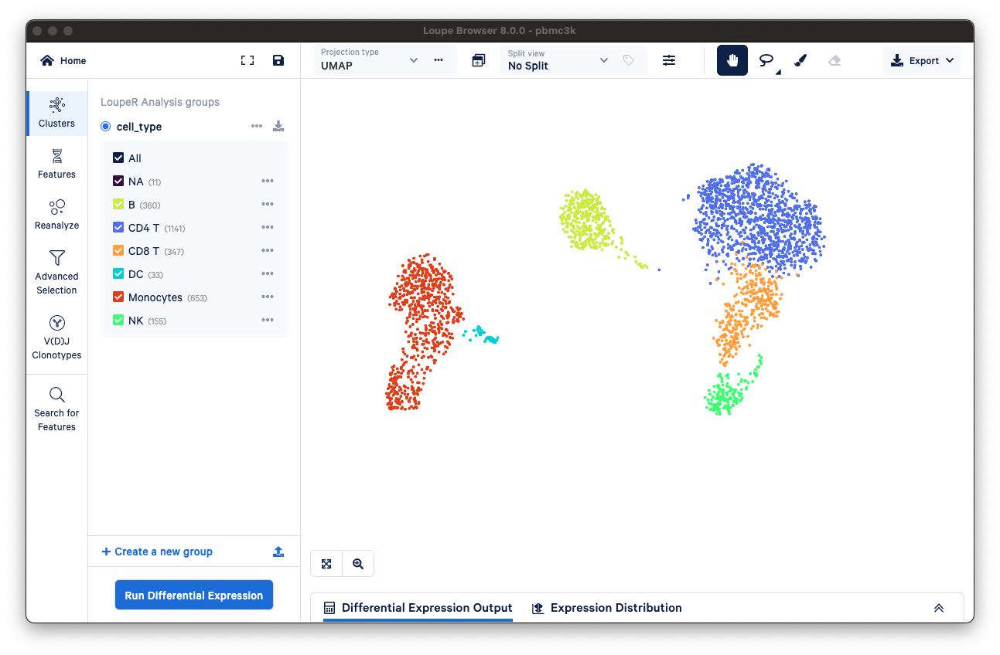

# Loupy
Export clusters, annotations and projections from ScanPy's AnnData object to Loupe Cell Browser's .cloupe file format.




Uses LoupeR from 10X: [https://github.com/10XGenomics/loupeR](https://github.com/10XGenomics/loupeR)

# Usage

## Python:

- Install:
```bash
pip install ./loupy
```

```python
from rpy2.robjects import conversion, default_converter
import loupy

with conversion.localconverter(default_converter):
    loupy.export_to_cloupe(
        adata.copy(), "output_path/filename.cloupe", layer="counts",
        projection_names=["umap"],
        categorical_names=["batch", "sample", "condition", "leiden"]
    )
```

## Terminal:

```bash
usage: loupy/loupy/loupy.py [-h] [--projections PROJECTIONS] [--categoricals CATEGORICALS] [--layer LAYER] input output

Export clusters, annotations and projections from ScanPy's AnnData object to Loupe Cell Browser's .cloupe file format.

positional arguments:
  input                 Input file
  output                Output file

options:
  -h, --help            show this help message and exit
  --projections PROJECTIONS
                        Comma-separated names (without 'X_'-prefix) of the projections to be exported. Should be found in 'adata.obsm_keys()' and be with two dimensions. Exports all projections by default.
  --categoricals CATEGORICALS
                        Comma-separated names of the categorical annotations to be exported. Should be found in 'adata.obs_keys()'. Exports all categorical features from adata.obs by default.
  --layer LAYER         Name of the layer to be exported. If not provided, adata.X will be exported.
```

## Export all projections and categorical annotations
 - `python loupy/loupy.py pbmc3k_analysed.h5ad pbmc3k.cloupe --layer=counts`

## Export specific projections and categorical annotations
- `python loupy/loupy.py pbmc3k_analysed.h5ad pbmc3k.cloupe --layer=counts --projections=tsne,umap --categoricals=cell_type`

# Environment

## Python
    - ScanPy
    - rpy2

## R
    - Seurat
    - SeuratData
    - SeuratDisk
    - loupeR
    - rhdf5
